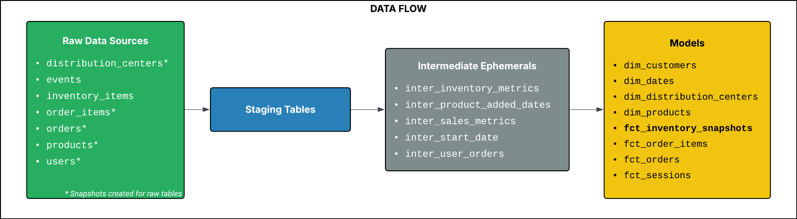
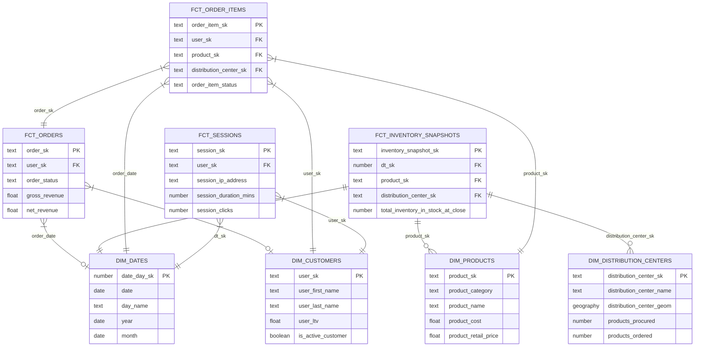

# 📦 TheLook eCommerce Data Warehouse
A production-grade **Analytics Engineering** project transforming raw event data into a high-performance **Star Schema** using **Snowflake** and **dbt**.

## 🗺️ 1. Architecture & Data Flow

<p align="center">
  
</p>

🔗 Live Documentation & Interactive DAG: [🟧 dbt docs](https://faheemrajwadkar.github.io/my-the-look-project/)

**The Data Source:**  
    The project utilizes **TheLook eCommerce dataset** — a high-fidelity, relational dataset [hosted](https://console.cloud.google.com/bigquery?p=bigquery-public-data&d=thelook_ecommerce&page=dataset&project=my-gcp-data-projects&ws=!1m9!1m4!4m3!1sbigquery-public-data!2sthelook_ecommerce!3sorder_items!1m3!3m2!1sbigquery-public-data!2sthelook_ecommerce) on **Google BigQuery**. It was selected for its **real-world complexity**, featuring **multi-table joins**, **event-level web traffic**, and **evolving order statuses** that necessitate sophisticated state management.

**Pipeline Infrastructure (ELT):**  

- **Storage & Ingestion:**
  - **Source:** Public BigQuery tables are exported as GZIP CSVs to GCS Buckets.
  - **Transport:** Staged in Google Cloud Storage (GCS).
  - **Load:** Ingested into Snowflake via External Stages, emulating a production-grade cloud-to-warehouse landing pattern.

- **Transformation Layer:** 
Leveraged dbt (data build tool) to implement a Modular Dimensional Model.
  - **Bronze (Staging):** Light cleaning and schema enforcement.
  - **Silver (Intermediate):** Complex business logic, product or order metric calculations, and historical versioning.
  - **Gold (Marts):** Audit-ready Star Schema optimized for BI performance and consistent metric reporting.

- **Orchestration & DevOps:**
  - **CI/CD:**
    - **Slim CI Pipeline:** Automated testing via GitHub Actions that identifies and tests only modified models using `state:modified+` logic. This minimizes Snowflake compute costs by deferring to production for unchanged upstream dependencies.
    - **Ephemeral Environments:** Orchestrated an automated cleanup process that drops temporary CI schemas in Snowflake upon Pull Request closure, ensuring a clutter-free and cost-efficient warehouse.
    - Gatekeeping: Strict enforcement of `dbt build` (`run` + `test`) to ensure zero-regression merges into the main branch.

  - **Workflow Management:** Apache Airflow manages the DAG execution, facilitating automated schedules and providing a centralized plane for pipeline monitoring and failure alerts.

</br>

## 🏗️ 2. Design Decisions
| Design Decision      | Selection              | Strategic Rationale ("The Why")                                                                                                                                                                                                            |
| -------------------- | ---------------------- | ------------------------------------------------------------------------------------------------------------------------------------------------------------------------------------------------------------------------------------------ |
| **Cloud Storage**        | **GCP Buckets**            | Selected to demonstrate cross-cloud architectural proficiency (GCP to Snowflake). Leveraged GCS for its high durability and cost-effective cold storage options for raw CSV/GZIP landing.                                                  |
| **Data Warehouse**       | **Snowflake**              | Chosen over Databricks for its superior handling of structured dimensional data. Features like **Zero-Copy Cloning** and **Automatic Micro-partitioning** make it the gold standard for high-concurrency BI workloads. |
| **Transformation**       | **dbt (Core/Cloud)**       | Acted as the central "Operating System" for the warehouse. Provided a version-controlled environment to enforce DRY (Don't Repeat Yourself) principles, automated testing, and native documentation.                                       |
| **Orchestration**        | **Apache Airflow**         | Industry-standard for complex dependency management. Used to orchestrate the end-to-end DAG—from GCS ingestion to dbt execution—ensuring strict cross-system synchronization.                                                              |
| **Data Modeling**        | **Kimball Star Schema**    | Optimized for end-user usability and BI performance. By centralizing logic in Fact tables and denormalizing Dimensions, we reduce join complexity for stakeholders and ensure a **Single Source of Truth (SSOT)**.                             |
| **Surrogate Keys**       | **MD5 Hashing**            | Used `dbt_utils.generate_surrogate_key` to create deterministic, platform-agnostic keys. Unlike auto-incrementing integers, **MD5 hashes** allow for **idempotent** re-runs and easier data integration across environments.                         |
| **Materialization**      | **Multi-layered Strategy** | **Staging (Views):** Minimized storage costs.<br><br>**Intermediate (Ephemeral):** Reduced warehouse clutter while keeping logic modular.<br><br>**Marts (Tables/Incremental):** Optimized for query speed.                                            |
| **Incremental Strategy** | **Merge (Lookback)**       | Implemented a merge strategy with a **T-3** lookback window. This ensures data integrity by capturing **late-arriving dimensions** or upstream updates without requiring expensive full-table refreshes.                                           |

<div style="width: 60%; margin: 0 auto;"> 
<p align="center"><strong>Data Model ER Diagram</strong></p>



</div>


</br>

## 🧠 3. Case Study: Optimizing fct_inventory_snapshots
**The Problem:** Creating a daily periodic snapshot for every product across every distribution center created a massive "Data Explosion." A naive cross-join generated **~76M rows**, leading to high storage costs and a **150-second runtime** that would have scaled exponentially.

<p align="center">
  
</p>

**Optimization 1: Intelligent Scaffolding (Row Reduction)**
- **Strategy:** Instead of a global start date for all products, I implemented a **Per-Product Start Date** based on the product's first entry in the inventory or its first transaction.
- **Impact:** Reduced row volume from **76M to 56M (24% reduction)**, significantly lowering the warehouse storage footprint.

**Optimization 2: Sparse Matrix Transformation (Runtime Efficiency)**
- **Strategy:** I **inverted** the execution order. Instead of running expensive window functions on the full 56M-row scaffolding, I performed windowing on a "Sparse" dataset of active transaction days (**~656K rows**). I then joined the scaffold to this result and used arithmetic extrapolation to fill the gaps.
- **Impact:** Runtime dropped from **~150s to ~60s (60% improvement)**.

**Optimization 3: The "Anchor-Delta" Incremental Pattern**
- Strategy: Standard incremental logic (`where date > max(date)`) breaks window functions (like `SUM() OVER()`). I implemented a pattern that "anchors" to the state of the last confirmed full day and appends the new daily "delta."
- Impact: Model refresh time is now **~12 seconds**, making it ultra-efficient for daily production runs.

**The Economic Impact (ROI)**
- **Compute Optimization:** Reduced Snowflake credit consumption by 92%
- **Storage Optimization:** Decreased the warehouse storage footprint by 24%
- **Engineering Standard:** These optimizations ensures the warehouse **scales linearly** with growth rather than exponentially, preventing a sudden surge in future Snowflake costs.

</br>

## 🧪 4. Data Quality & Operational Rigor
- **State Management:** Implemented **SCD Type 2 Snapshots** on volatile sources (e.g., Product Pricing, Order Status, User Details) to maintain historical accuracy and prevent "data amnesia."
- **Data Contracts:** Enforced integrity through a hybrid testing strategy:
  - **Generic Tests:** Uniqueness, non-nullability, and referential integrity across the Star Schema.
  - **Singular Tests:** Custom SQL snippets to validate business logic (e.g., ensuring inventory levels never drop below zero).
  - **Observability:** Integrated Source Freshness monitoring to detect and alert on upstream ingestion delays.
- **Engineering Standards & Handover:** Maintained 100% metadata coverage using **Modular YAML files** and **Doc Blocks**, ensuring the warehouse is self-documenting and accessible to stakeholders.

</br>

## 🎓 5. Lessons Learned
- **Snapshot Sequencing:** I learned that snapshots must be implemented directly at the source to preserve an immutable history before any staging logic is applied. 
- **Materialization Trade-offs:** Opting for ephemeral intermediate models taught me how to balance development experience (debugging ease, code modularity) with warehouse performance and cleanliness. 
- **Self-Healing Logic:** While developing the Anchor-Delta pattern (T-3 lookback window), reinforced the importance of idempotency, ensuring that a pipeline can fail and recover without manual data intervention.

**What went wrong:** 
  - Initially underestimated the complexity of developing an efficient inventory snapshot fact table. 
  - Should have created snapshots before staging, realized it later and had to re-do my staging models.

**What I’d try to do differently:** 
    - If scaling to 100x data, I would implement Incremental models for the Staging layer earlier, and subsequently for Dimension tables as well.
    - Explore **Hybrid Materializations** for Intermediate tables: I would try using Snowflake Temporary Tables for compute-heavy logic that is too expensive to run as a subquery (Ephemeral), but too transient to store permanently.

</br>

## 📂 6. Project Structure
```bash
├── macros/               # Custom SQL logic (e.g., timestamp casting)
├── models/
│   ├── staging/          # Ingestion layer with source-aligned sub-folders
│   ├── intermediate/     
│   │   ├── prep/         # Source data transformations for Snapshots
│   │   └── marts/        # Business logic & metric calculations
│   └── marts/            # Final Star Schema (Gold layer) for BI consumption
├── snapshots/            # SCD Type 2 logic for volatile source tracking
└── tests/                
    ├── generic/          # Reusable schema validation tests
    └── singular/         # Business-critical logic (e.g., Inventory Stock Match)
```

</br>

## ⚙️ 7. How to Reproduce
1. Clone the Repo: `git clone <repo-link>`
2. Install Dependencies: `dbt deps`
3. Build the Warehouse: `dbt build` (This will run snapshots, models, and tests in the correct order).
